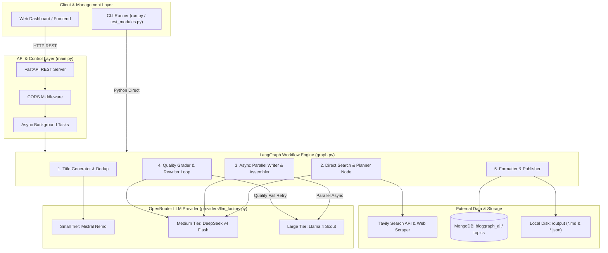
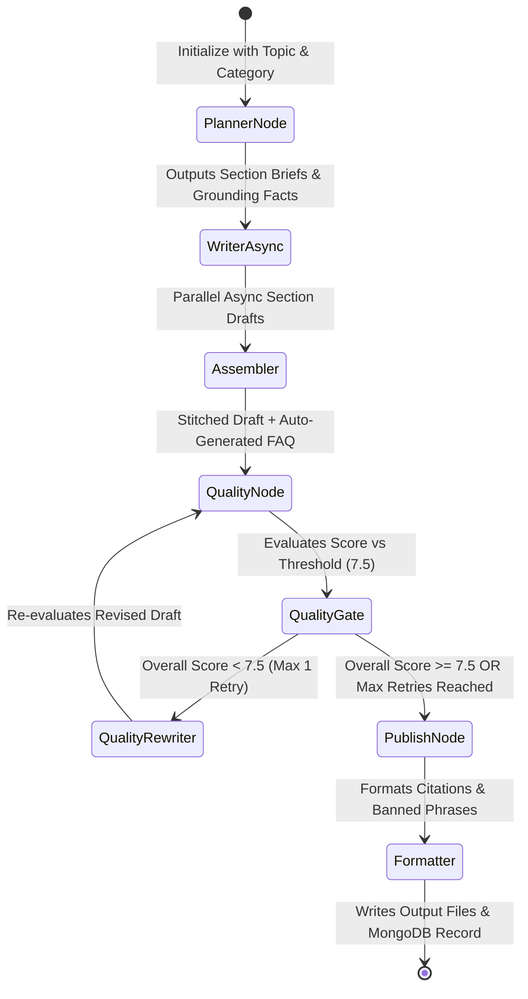

# 🏗️ BlogGraph-AI — System Architecture & Technical Design

## Executive Summary

**BlogGraph-AI** is an enterprise-grade, autonomous technical content generation and publishing engine. Built using **LangGraph**, **FastAPI**, **MongoDB**, and **OpenRouter**, it produces publication-ready, deeply researched technical blogs complete with real web citations, interactive UI components, auto-generated FAQs, and automated quality control loops.

### Key Architectural Highlights
- **Flattened Map-Reduce Pipeline**: Refactored from a slow 24-step loop into a high-throughput **5-node workflow** executing in ~150 seconds.
- **OpenRouter Multi-Tier Model Allocation**: Dynamically routes workloads across **Small** (Mistral Nemo), **Medium** (DeepSeek v4 Flash), and **Large** (Llama 4 Scout) models for cost efficiency and writing performance.
- **Async Parallel Writing**: Section drafts are generated concurrently using Python `asyncio` map-reduce.
- **Deterministic & Qualitative Quality Gates**: Dual-pass quality scoring (Flesch Reading Ease + LLM evaluation) with automated retry loop rewriter.
- **Dual Persistence Strategy**: Simultaneously persists structured metadata and markdown to local filesystem sidecars (`/output`) and local/cloud **MongoDB** (`localhost:27017` / `bloggraph_ai`).
- **REST API Suite**: Fully-featured **FastAPI** server exposing endpoints for listing, viewing, editing, approving, generating, and deleting blog posts.

---

## 🏛️ High-Level System Architecture



---

## 🔄 LangGraph State Machine Trajectory

The core graph is defined in `graph.py` using LangGraph's `StateGraph`. The state dictionary `BlogState` accumulates outputs through every node execution:



---

## 🧩 Pipeline Module Breakdown

### Module 1: Title Generation & Deduplication
- **Components**: `topic_selection/title_generator.py`, `dedup_checker.py`, `queue_manager.py`
- **Model**: OpenRouter Small Tier (`mistralai/mistral-nemo`)
- **Process**:
  1. Selects category based on priority queue weights.
  2. Queries historical titles from **MongoDB** and local `/output` JSON metadata.
  3. Uses RapidFuzz fuzzy ratio matching to ensure new title is not a duplicate.
  4. Strips markdown bolding (`**`), quotes, and backticks.

### Module 2: Direct Search & Intake Planner
- **Components**: `retrieval/retrieval_agent.py`, `retrieval/tools/tavily_search.py`, `agents/planner.py`
- **Model**: OpenRouter Medium Tier (`deepseek/deepseek-v4-flash`)
- **Process**:
  1. Executes 3 targeted queries via Tavily Search API.
  2. Scrapes target web pages to collect raw content (~30k characters).
  3. Aggregates and extracts verified facts (`fact_1`, `fact_2`, ...).
  4. Generates section-by-section outline, assigning facts **exclusively** to sections.

### Module 3: Async Parallel Writer, Assembler & Auto-FAQ
- **Components**: `agents/writer.py`, `agents/assembler.py`
- **Model**: OpenRouter Large Tier (`meta-llama/llama-4-scout`) for Sections, Medium Tier for FAQ
- **Process**:
  1. Writes all sections concurrently using Python `asyncio.gather()`.
  2. Enforces writing persona (`authoritative_expert`, `analytical_reviewer`, etc.).
  3. Embeds structured `COMPONENT:` specs (`comparison_widget`, `table`, `code_block`, max 1 `quiz`).
  4. Dynamically generates 4 authoritative FAQ answers referencing verified facts.
  5. Stitches sections cleanly with Auto-FAQ placed at the very end.

### Module 4: Quality Scoring & Feedback Loop
- **Components**: `agents/quality.py`, `graph.py` (`quality_gate`)
- **Model**: OpenRouter Medium Tier for Grader, Large Tier for Rewriter
- **Process**:
  1. Calculates quantitative **Flesch Reading Ease** readability score.
  2. Runs deterministic structure, length, and placeholder checks.
  3. Evaluates 7 qualitative dimensions (Readability, Diversity, Repetition/Padding, Depth, Coherence, Actionability, Evidence).
  4. If `overall_score < 7.5` and `revision_count < 1`, routes to `quality_rewriter` to revise weak sections, then re-grades.

### Module 5: Post-Processing & Multi-Target Persistence
- **Components**: `agents/formatter.py`, `topic_selection/mongo_db.py`, `main.py`
- **Process**:
  1. Converts raw citations `[fact_N](url)` into human-readable markdown links `[Domain](url)`.
  2. Programmatically strips `BANNED_PHRASES` and fixes orphan punctuation (`, while...` → `While...`).
  3. Writes Markdown file and Metadata JSON sidecar to `/output/`.
  4. Upserts/Inserts published record into MongoDB (`localhost:27017` / `bloggraph_ai` / `topics`).

---

## ⚡ OpenRouter Model Tiering Matrix

| Tier | Configured Model | Primary Responsibilities | Temperature |
| :--- | :--- | :--- | :--- |
| **Small** | `mistralai/mistral-nemo` | Topic Title Generation, Rapid checks | `0.7` |
| **Medium** | `deepseek/deepseek-v4-flash` | Intake Planning, Fact Extraction, Quality Grading, Auto-FAQ | `0.0` – `0.4` |
| **Large** | `meta-llama/llama-4-scout` | Async Section Writing, Targeted Quality Rewriter | `0.7` |

---

## 💾 Storage & Data Schemas

### 1. MongoDB Document Schema (`topics` Collection)

```json
{
  "_id": "ObjectId(...)",
  "trace_id": "8f3a9b21-4c12...",
  "category": "Developer Technology",
  "title": "Is Microservices the Future of System Design in 2026?",
  "status": "published",
  "output_filename": "is-microservices-the-future-of-system-design-in-2026.md",
  "quality_score": 7.8,
  "word_count": 2174,
  "created_at": "2026-08-11T13:56:54.000Z",
  "completed_at": "2026-08-11T13:59:21.000Z",
  "markdown_content": "# Is Microservices the Future...",
  "metadata_json": "{\"slug\": \"is-microservices...\", \"focus_keyword\": \"microservices system design 2026\"...}",
  "approved": "yes"
}
```

### 2. Output File Structure (`/output`)
For every published blog, two artifacts are generated side-by-side:
- **Markdown File**: `output/<slug>.md` — Clean Markdown containing frontmatter header, section prose, `COMPONENT:` blocks, and FAQ.
- **Metadata Sidecar**: `output/<slug>.json` — Full metadata JSON (slug, tags, word count, quality score, keywords, reading time).

---

## 🔌 FastAPI REST API Specification

The API server (`main.py`) runs on Uvicorn (`http://127.0.0.1:8000`) and provides full CRUD and execution management:

```mermaid
gantt
    title FastAPI Endpoint Suite
    dateFormat  X
    section REST API Endpoints
    GET /api/blogs             :active, 0, 1
    GET /api/blogs/{slug}      :active, 1, 2
    PUT /api/blogs/{slug}      :active, 2, 3
    PUT /api/blogs/{slug}/approve :active, 3, 4
    POST /api/blogs/generate   :active, 4, 5
    DELETE /api/blogs/{slug}   :active, 5, 6
```



| Method | Endpoint | Description | Query / Body Params |
| :--- | :--- | :--- | :--- |
| `GET` | `/` | API Health & Version Status | None |
| `GET` | `/api/blogs` | List all blogs with pagination & filters | `category`, `status`, `approved`, `skip`, `limit` |
| `GET` | `/api/blogs/{slug}` | Fetch single blog markdown & metadata | `slug` (Path param) |
| `PUT` | `/api/blogs/{slug}` | **Edit API**: Update title, content, tags, keywords | `BlogUpdateRequest` (JSON body) |
| `PUT` | `/api/blogs/{slug}/approve` | **Approval API**: Approve/Reject post (`yes`/`no`) | `ApprovalRequest` (`{"approved": "yes"}`) |
| `POST` | `/api/blogs/generate` | **Generation API**: Trigger AI pipeline background run | `GenerationRequest` (`category`, `topic`) |
| `DELETE` | `/api/blogs/{slug}` | **Delete API**: Delete post from disk & MongoDB | `slug` (Path param) |

---

## 📁 Repository Directory Map

```
Blog-Platform/
├── agents/                     # LangGraph Node Implementations
│   ├── assembler.py            # Section stitching & Auto-FAQ generator
│   ├── formatter.py            # Markdown cleaner, citation formatter, banned phrase stripper
│   ├── planner.py              # Intake planner & Exclusive fact assignment
│   ├── quality.py              # Flesch Readability, Quality grader & rewriter node
│   ├── utils.py                # Robust JSON parser & text sanitizers
│   └── writer.py               # Async parallel section writing node
├── docs/                       # Project Documentation & Architecture Guides
│   └── ARCHITECTURE.md         # Full System Architecture Specification
├── output/                     # Output Directory for Markdown Posts & JSON Sidecars
│   └── module_outputs/         # Granular module execution traces & test artifacts
├── providers/                  # LLM Factory Provider
│   └── llm_factory.py          # OpenRouter client initialization & tier mapping
├── retrieval/                  # Search & Research Engine
│   ├── data_formatter.py       # Raw scraped text chunker & fact list structurer
│   ├── retrieval_agent.py      # Search orchestration & fact extraction
│   └── tools/                  # Tavily Search API & Web Scraper scripts
├── topic_selection/            # Topic & Queue Management
│   ├── dedup_checker.py        # RapidFuzz title similarity checker
│   ├── mongo_db.py             # MongoDB client & collection index manager
│   ├── queue_manager.py        # Category priority queue & title history retriever
│   └── title_generator.py      # Dynamic title generator & markdown stripper
├── config.py                   # System configuration, model tiers & banned phrases
├── graph.py                    # LangGraph StateGraph pipeline definition
├── main.py                     # FastAPI REST API Server (Port 8000)
├── run.py                      # CLI Pipeline Execution Runner
├── schemas.py                  # Pydantic Schemas & BlogState dictionary
├── test_modules.py             # Modular End-to-End Test Suite
└── requirements.txt            # Python Dependencies
```
